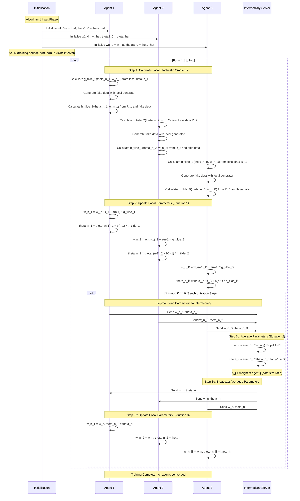

# FedGAN PoC Implementation Plan

## Goal Description

Implement a Proof of Concept (PoC) for **FedGAN (Federated Generative Adversarial Network)** based on Algorithm 1 from the paper "FedGAN: Federated Generative Adversarial Networks for Distributed Data" (arXiv:2006.07228v2).

This PoC will:
- Implement the core FedGAN algorithm with multiple agents, each having local generator and discriminator
- Use MNIST dataset partitioned across agents (non-iid)
- Run in a single-process, single-loop simulation (no actual network communication)
- Generate visualization outputs: animated GIF of generated images per epoch, and loss graphs
- Use TensorFlow 2.16.2 with the GAN architecture from the existing tutorial

## User Review Required

> [!IMPORTANT]
> **Design Decisions Requiring Confirmation**
> 
> The following parameters need to be set for the PoC. Please confirm or provide alternative values:
> 
> 1. **Number of Agents (B)**: 5 agents (following paper's experiments)
> 2. **Synchronization Interval (K)**: 20 iterations (following paper's MNIST experiment)
> 3. **Training Iterations (N)**: 50 epochs × batches_per_epoch (approximately 1,172 iterations per epoch with batch_size=256)
> 4. **Learning Rates**: a(n) = b(n) = 1e-4 (equal time-scale update, same as tutorial)
> 5. **Non-IID Data Split**: Split MNIST by digit classes - each agent gets 2 digit classes (e.g., Agent 1: digits 0,1; Agent 2: digits 2,3, etc.)
> 6. **Batch Size**: 256 (same as tutorial)
> 7. **Noise Dimension**: 100 (same as tutorial)
> 8. **Number of Epochs**: 50 (as requested)
> 
> **Additional Questions:**
> - Should we track and visualize per-agent losses separately, or only the averaged/global losses?
> - Should the generated images GIF show samples from all agents or just one representative agent?

## FedGAN Processing Sequence

The following Mermaid diagram illustrates the FedGAN algorithm flow based on Algorithm 1:



## Proposed Changes

### Core Implementation

#### [NEW] [fedgan_poc.py](../fedgan_poc.py)

Main FedGAN implementation file containing:
- `FedGANAgent` class: Encapsulates local generator, discriminator, and training logic for each agent
  - Local dataset partition (non-iid MNIST subset)
  - Local generator and discriminator models (reusing tutorial architecture)
  - Methods for computing local stochastic gradients
  - Methods for parameter updates following Algorithm 1
- `FedGANServer` class: Intermediary server for parameter synchronization
  - Weighted averaging of agent parameters (Equation 2 from Algorithm 1)
  - Broadcasting averaged parameters back to agents
- `FedGANTrainer` class: Orchestrates the training loop
  - Implements the main loop (n=1 to N-1) from Algorithm 1
  - Manages synchronization at intervals K
  - Tracks losses per epoch
  - Generates visualization outputs (images, GIF, loss graphs)

---

#### [NEW] [models.py](../models.py)

GAN model definitions (reused from tutorial):
- `make_generator_model()`: DCGAN generator architecture
- `make_discriminator_model()`: DCGAN discriminator architecture
- `generator_loss()`: Generator loss function
- `discriminator_loss()`: Discriminator loss function

---

#### [NEW] [data_utils.py](../data_utils.py)

Dataset utilities:
- `load_and_partition_mnist()`: Load MNIST and partition into non-iid subsets
  - Split by digit classes (each agent gets 2 classes)
  - Return list of datasets, one per agent
  - Calculate and return agent weights (p_j) based on data sizes

---

#### [NEW] [visualization.py](../visualization.py)

Visualization utilities:
- `generate_and_save_images()`: Generate images from a generator at a given epoch
- `create_animation_gif()`: Create animated GIF from per-epoch images
- `plot_losses()`: Plot and save combined generator + discriminator losses per epoch

---

### Configuration and Execution

#### [NEW] [config.py](../config.py)

Configuration parameters:
- Number of agents (B)
- Synchronization interval (K)
- Number of epochs
- Learning rates a(n), b(n)
- Batch size, noise dimension
- Output directories

---

#### [NEW] [requirements.txt](../requirements.txt)

Python dependencies (based on tutorial):
```
tensorflow==2.16.2
tensorflow-metal>=0.8.4
numpy>=1.26.0
matplotlib>=3.7.0
imageio>=2.31.0
pillow>=10.0.0
pandas>=2.2.0
```

---

#### [NEW] [README.md](../README.md)

Documentation:
- Overview of FedGAN PoC
- Setup instructions (venv, dependencies)
- How to run the PoC
- Output descriptions (GIF, loss graphs)
- Mapping to Algorithm 1 from the paper

---

## Implementation Details

### Algorithm 1 Mapping

The code will include detailed comments mapping each section to Algorithm 1:

1. **Initialization (Lines 166)**: Initialize all agents with same initial parameters
2. **Main Loop (Line 169)**: Iterate from n=1 to N-1
3. **Gradient Calculation (Line 170)**: Each agent computes local stochastic gradients
4. **Parameter Update (Lines 173-179, Equation 1)**: SGD update for discriminator and generator
5. **Synchronization Check (Line 181)**: Check if n mod K == 0
6. **Parameter Averaging (Lines 184-188, Equation 2)**: Weighted average at server
7. **Parameter Broadcasting (Lines 189-193)**: Sync all agents with averaged parameters

### Key Design Choices

1. **Single-Process Simulation**: All agents and server run in the same process, no actual network communication
2. **Epoch-based Visualization**: Generate images and compute losses per epoch (1 epoch = full pass through local dataset)
3. **Equal Time-Scale**: Use a(n) = b(n) for simplicity (equal learning rates for generator and discriminator)
4. **Non-IID Data**: Partition MNIST by digit classes to simulate heterogeneous data distribution
5. **Weighted Averaging**: Use data size ratios (p_j) for weighted averaging as specified in Algorithm 1

## Verification Plan

### Automated Tests

1. **Run FedGAN PoC**:
   ```bash
   python fedgan_poc.py --epochs 50 --num_agents 5 --sync_interval 20
   ```

2. **Verify Outputs**:
   - Check that `outputs/training_progress.gif` is created
   - Check that `outputs/losses.png` shows both generator and discriminator losses
   - Check that `outputs/images/` contains per-epoch generated images

### Manual Verification

1. **Visual Inspection**:
   - Review the animated GIF to see if generated images improve over epochs
   - Check loss graph for convergence trends
   - Compare generated images quality with centralized GAN (from tutorial)

2. **Algorithm Correctness**:
   - Verify that synchronization happens every K iterations
   - Verify that all agents receive the same averaged parameters after sync
   - Check that loss values are reasonable (not NaN or diverging)
