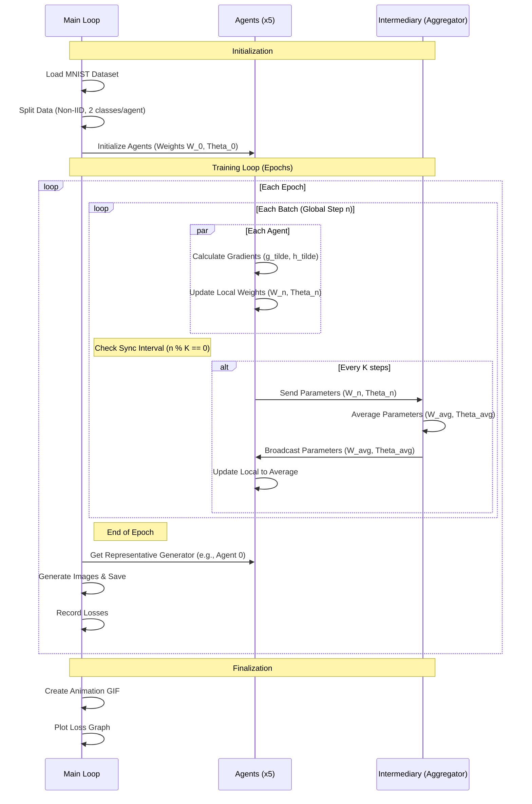

# FedGAN PoC Implementation Plan

## Goal Description
Implement a Proof of Concept (PoC) for FedGAN (Federated Generative Adversarial Networks) based on Algorithm 1 of the paper "FedGAN: Federated Generative Adversarial Networks for Distributed Data".
The implementation will use TensorFlow and the MNIST dataset. It will be a single-process simulation of multiple agents.
The base GAN architecture will be taken from the provided TensorFlow tutorial (`examples/gan_tf_tutorial/train.py`).

## User Review Required
> [!IMPORTANT]
> **Model Architecture**: The paper uses ACGAN for MNIST, but you requested to use the `gan_tf_tutorial` (DCGAN) architecture. I will proceed with the DCGAN architecture from the tutorial, adapted for FedGAN (weight averaging).

> [!NOTE]
> **Hyperparameters**:
> - **Agents (B)**: 5 (based on paper experiments).
> - **Synchronization Interval (K)**: 20 steps (based on paper experiments for MNIST).
> - **Epochs**: 50 (based on tutorial default).
> - **Batch Size**: 256 (based on tutorial default).
> - **Data Split**: Non-iid, 2 classes per agent (e.g., Agent 1: 0-1, Agent 2: 2-3, etc.).

## Proposed Changes

### Project Structure
I will create a new directory `fedgan_poc` or simply use the root to create `fedgan_train.py` (or similar) to keep it separate from the example but utilizing the same environment.
Given the user wants to "implement PoC", I will create a new file `fedgan_train.py` in `examples/gan_tf_tutorial/` or a new folder.
I will create `fedgan_train.py` in `examples/gan_tf_tutorial/` to easily import/reference the existing code if needed, or just copy relevant parts to be self-contained.
I will make `fedgan_train.py` self-contained but based on `train.py`.

### Logic Flow (Mermaid)

### Implementation Details

#### `fedgan_train.py`
- **Data Loading**: Load MNIST, filter by label to create 5 partitions.
- **Model Creation**: Use `make_generator_model` and `make_discriminator_model` from `train.py`.
- **Agent Class**:
  - Holds `generator`, `discriminator`, `gen_optimizer`, `disc_optimizer`.
  - `train_step(images)`: Performs local update.
  - `get_weights()`: Returns list of weights.
  - `set_weights(weights)`: Sets weights.
- **Training Loop**:
  - Iterate epochs.
  - Iterate batches (zipped from all agent datasets or round-robin).
  - `global_step` tracking.
  - Sync logic:
    - `average_weights(agents)`: Compute mean of weights.
    - Apply to all agents.
- **Visualization**:
  - Use `generate_and_save_images` logic.
  - Use `make_gif` logic.
  - Use `plot_and_save_losses` logic.

## Verification Plan
### Automated Tests
- Run `python examples/gan_tf_tutorial/fedgan_train.py --epochs 2` (fast run) to verify:
  - No crashes.
  - Images generated.
  - GIF created.
  - Loss plot created.
  - Weights are actually syncing (can add print debugs or check if agents diverge then converge).

### Manual Verification
- Inspect `fedgan_train.py` to ensure comments map to Algorithm 1.
- Check the generated GIF to see if digits are forming (even if poor quality in short run).
