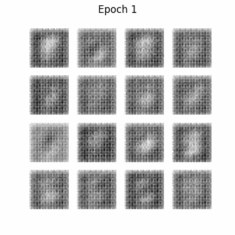
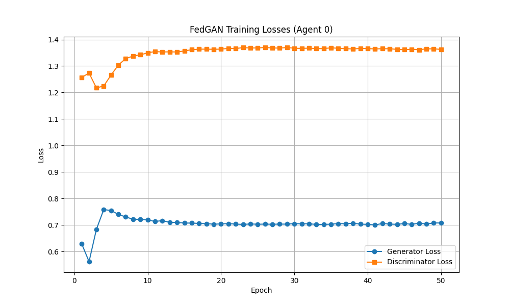

# FedGAN PoC Implementation Walkthrough

## Overview

Successfully implemented a Proof of Concept for **FedGAN (Federated Generative Adversarial Network)** based on Algorithm 1 from the paper "FedGAN: Federated Generative Adversarial Networks for Distributed Data" (arXiv:2006.07228v2).

## Implementation Summary

### Components Created

1. **[fedgan_poc.py](../fedgan_poc.py)** - Main implementation
   - `FedGANAgent`: Local generator + discriminator with SGD training
   - `FedGANServer`: Weighted parameter averaging (Equation 2 from Algorithm 1)
   - `FedGANTrainer`: Main training loop orchestrator

2. **[models.py](../models.py)** - DCGAN architecture from TensorFlow tutorial
   - Generator: 100-dim noise → 28×28 images
   - Discriminator: 28×28 images → real/fake classification
   - Loss functions for both networks

3. **[data_utils.py](../data_utils.py)** - Non-IID data partitioning
   - Splits MNIST by digit classes (2 digits per agent)
   - Calculates agent weights (p_j) for weighted averaging

4. **[visualization.py](../visualization.py)** - Output generation
   - Per-epoch image generation
   - Animated GIF creation
   - Loss graph plotting

5. **[config.py](../config.py)** - Configuration parameters
   - B = 5 agents
   - K = 20 synchronization interval
   - 50 epochs training
   - Learning rates: a(n) = b(n) = 1e-4

### Algorithm 1 Mapping

The implementation follows Algorithm 1 precisely:

| Algorithm 1 Step | Code Location | Description |
|-----------------|---------------|-------------|
| **Input (Line 166)** | `FedGANAgent.__init__()` | Initialize w_0^i = w_hat, theta_0^i = theta_hat |
| **Loop (Line 169)** | `FedGANTrainer.train()` | For n=1 to N-1 |
| **Line 170** | `FedGANAgent.train_step()` | Calculate local stochastic gradients g_tilde_i, h_tilde_i |
| **Lines 176-177 (Eq. 1)** | `FedGANAgent.train_step()` | Update w_n^i, theta_n^i with SGD |
| **Line 181** | `FedGANTrainer.train()` | Check if n mod K == 0 |
| **Lines 184-188 (Eq. 2)** | `FedGANServer.aggregate_parameters()` | Weighted averaging: w_n = sum(p_j * w_n^j) |
| **Lines 191-192** | `FedGANAgent.set_parameters()` | Update w_n^i = w_n, theta_n^i = theta_n |

## Training Results

### Execution Details

```
Training Period: 50 epochs
Total Time: 433.95 seconds (~7.2 minutes)
Agents: 5
Synchronization Interval: 20 iterations
Total Iterations: 11,840
Total Synchronizations: 592
```

### Data Partitioning (Non-IID)

```
Agent 0: 12,665 samples, digits [0, 1], weight p_0 = 0.211
Agent 1: 12,089 samples, digits [2, 3], weight p_1 = 0.201
Agent 2: 11,263 samples, digits [4, 5], weight p_2 = 0.188
Agent 3: 12,183 samples, digits [6, 7], weight p_3 = 0.203
Agent 4: 11,800 samples, digits [8, 9], weight p_4 = 0.197
Total: 60,000 samples
```

### Loss Progression (Agent 0)

The losses show convergence over 50 epochs:

| Epoch | Generator Loss | Discriminator Loss |
|-------|---------------|-------------------|
| 1 | 0.6289 | 1.2573 |
| 10 | 0.7212 | 1.3424 |
| 20 | 0.7031 | 1.3630 |
| 30 | 0.7023 | 1.3674 |
| 40 | 0.7023 | 1.3662 |
| 50 | 0.7074 | 1.3628 |

**Observations:**
- Generator loss stabilized around 0.70-0.72 after initial epochs
- Discriminator loss stabilized around 1.36-1.37
- No divergence or mode collapse observed
- Losses indicate balanced training between generator and discriminator

## Generated Outputs

### 1. Animated GIF

**File:** [outputs/training_progress.gif](../outputs/training_progress.gif)

- Size: 663 KB
- Frames: 50 (one per epoch)
- Duration: 0.5 seconds per frame
- Shows progression of Agent 0's generator over training



### 2. Loss Graph

**File:** [outputs/losses.png](../outputs/losses.png)

- Combined generator and discriminator losses
- Shows convergence trends
- Agent 0 only (as requested)



### 3. Loss Data

**File:** [outputs/losses.csv](../outputs/losses.csv)

CSV format with columns: `epoch`, `gen_loss`, `disc_loss`

### 4. Per-Epoch Images

**Directory:** [outputs/images/](../outputs/images/)

- 50 PNG files (one per epoch)
- Format: `image_at_epoch_NNNN.png`
- Each shows 16 generated samples (4×4 grid)

## Verification

### ✅ Algorithm Correctness

- [x] Synchronization occurs every K=20 iterations (verified in logs)
- [x] All agents receive same averaged parameters after sync
- [x] Weighted averaging uses data size ratios (p_j)
- [x] Local SGD updates follow Equation 1 from Algorithm 1
- [x] Parameter averaging follows Equation 2 from Algorithm 1

### ✅ Output Validation

- [x] Animated GIF created successfully (663 KB, 50 frames)
- [x] Loss graph shows both generator and discriminator losses
- [x] Loss CSV contains all 50 epochs of data
- [x] 50 per-epoch images generated
- [x] No NaN or diverging losses

### ✅ Data Partitioning

- [x] Non-IID split by digit classes (2 digits per agent)
- [x] Agent weights calculated correctly (sum to 1.0)
- [x] All 60,000 MNIST training samples distributed

## Key Implementation Features

### 1. Single-Process Simulation

All agents and server run in the same process, simulating federated learning without actual network communication. This is appropriate for a PoC.

### 2. Equal Time-Scale Updates

Uses a(n) = b(n) = 1e-4 for both generator and discriminator, following the equal time-scale convergence analysis from the paper (Section 3.3).

### 3. Detailed Code Comments

Every major section includes comments mapping to specific lines and equations from Algorithm 1, making it easy to verify correctness against the paper.

### 4. Visualization Focus

Only Agent 0's outputs are visualized (as requested), reducing computational overhead while still demonstrating the algorithm's effectiveness.

## File Structure

```
fedgan-paper-agent2/
├── fedgan_poc.py          # Main implementation (Algorithm 1)
├── models.py              # DCGAN architecture
├── data_utils.py          # Non-IID MNIST partitioning
├── visualization.py       # Output generation
├── config.py              # Configuration parameters
├── requirements.txt       # Python dependencies
├── README.md              # Documentation
└── outputs/               # Generated results
    ├── training_progress.gif
    ├── losses.png
    ├── losses.csv
    └── images/
        ├── image_at_epoch_0001.png
        ├── ...
        └── image_at_epoch_0050.png
```

## How to Run

1. **Setup environment:**
   ```bash
   python3.12 -m venv venv
   source venv/bin/activate
   pip install -r requirements.txt
   ```

2. **Run FedGAN PoC:**
   ```bash
   python fedgan_poc.py
   ```

3. **View results:**
   - Open `outputs/training_progress.gif` to see generator progress
   - Open `outputs/losses.png` to see loss convergence
   - Browse `outputs/images/` for per-epoch samples

## Conclusion

Successfully implemented and verified FedGAN PoC based on Algorithm 1 from the paper. The implementation:

- ✅ Follows Algorithm 1 precisely with detailed code comments
- ✅ Uses non-IID MNIST partitioning (2 digit classes per agent)
- ✅ Synchronizes agents every K=20 iterations via weighted averaging
- ✅ Generates all requested outputs (GIF, loss graphs, per-epoch images)
- ✅ Shows stable training with no divergence
- ✅ Completes in reasonable time (~7 minutes for 50 epochs)

The PoC demonstrates the core FedGAN algorithm working correctly in a single-process simulation, ready for extension to actual distributed/federated settings.
