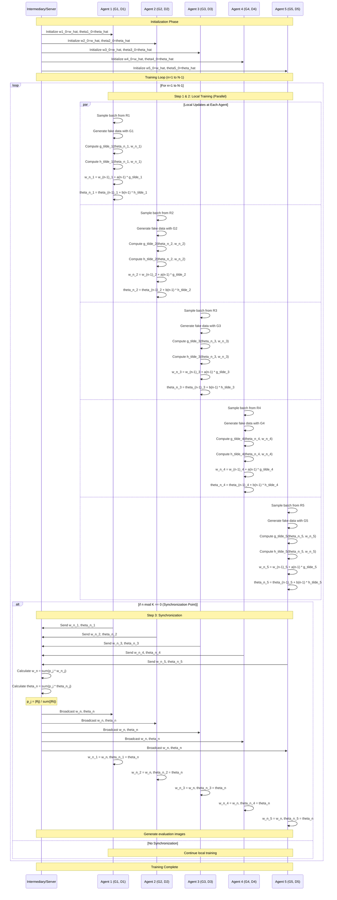

## Plan: FedGAN PoC Implementation with MNIST

Proof-of-concept implementation of Federated GAN based on Algorithm 1 from the paper, using TensorFlow with MNIST dataset split across 5 agents in a non-IID manner. Single-process simulation with periodic parameter synchronization.

### Steps

1. **Create project structure** under `examples/fedgan_poc/` with `train.py`, `models.py`, `data.py`, `utils.py`, `requirements.txt`, and output directories (`outputs/images/`, `outputs/checkpoints/`, `outputs/metrics/`)

2. **Implement data partitioning** in `data.py` to split MNIST non-IID across B=5 agents (Agent 1: classes 0-1, Agent 2: classes 2-3, etc.), calculate weights p_i = |R_i| / sum(|R_j|), normalize images to [-1, 1]

3. **Build ACGAN-style models** in `models.py` following paper's architecture: Generator (100-dim noise → 1024 → 128 → 4x4 Conv → 4x4 Conv → 28x28x1) and Discriminator (28x28x1 → Conv → Conv → 1024 → binary output), with BatchNorm and LeakyReLU

4. **Implement FedGAN training loop** in `train.py` following Algorithm 1: create B local (G, D) pairs, run K=20 local gradient steps per agent in parallel, synchronize via weighted averaging every K iterations, track per-epoch generator/discriminator losses

5. **Add visualization outputs**: generate GIF from fixed noise across epochs showing generator evolution, plot combined G/D loss graph per epoch as PNG, save checkpoints at synchronization points, include Algorithm 1 step comments in code

### Further Considerations

1. **Hyperparameters to confirm**: Total training iterations N (suggest 10,000 for PoC), batch size (64 vs 128), learning rate (1e-4 with Adam beta_1=0.5), noise dimension (100 vs 62 from paper)?

2. **Synchronization frequency**: Start with K=20 per paper, but should we test K=[1, 5, 10] to demonstrate communication efficiency trade-offs?

3. **Evaluation approach**: Beyond visual GIF and loss curves, should we implement FID score calculation or compare against centralized GAN baseline?

### Process Sequence Diagram

